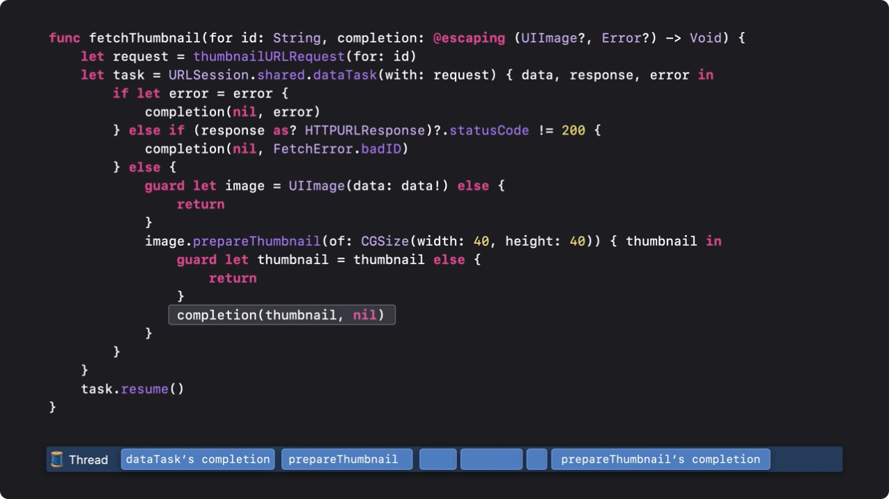
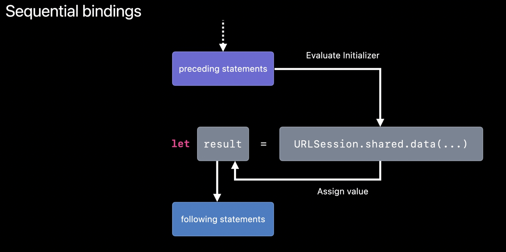
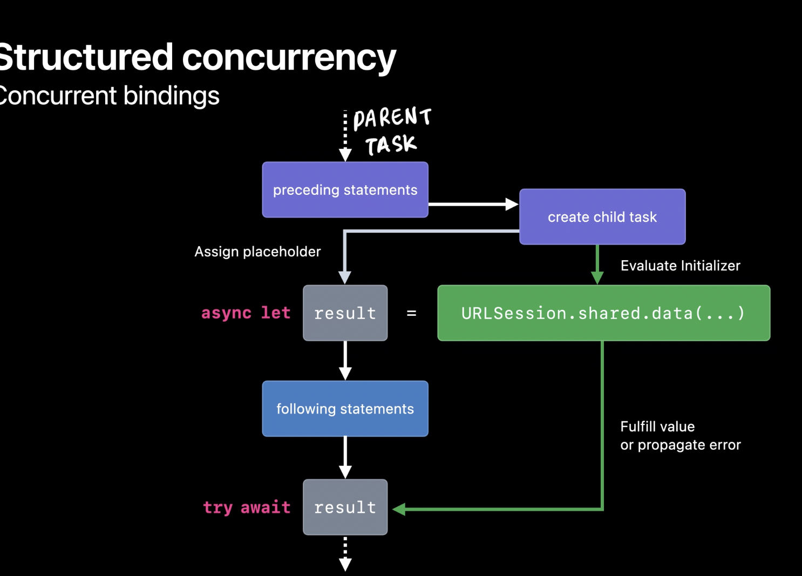
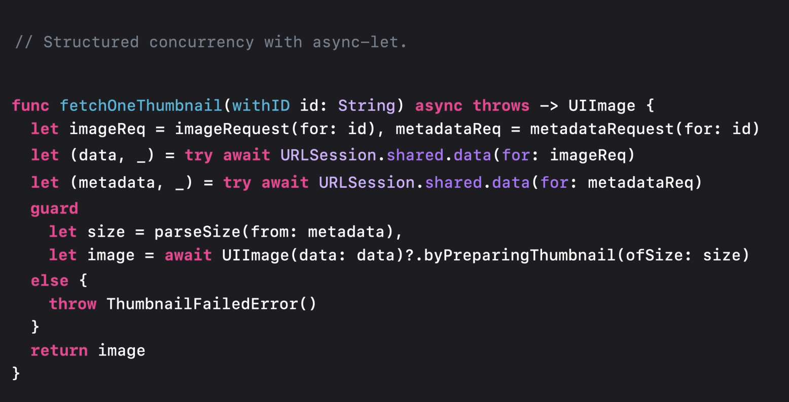
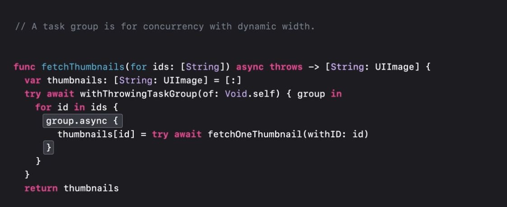
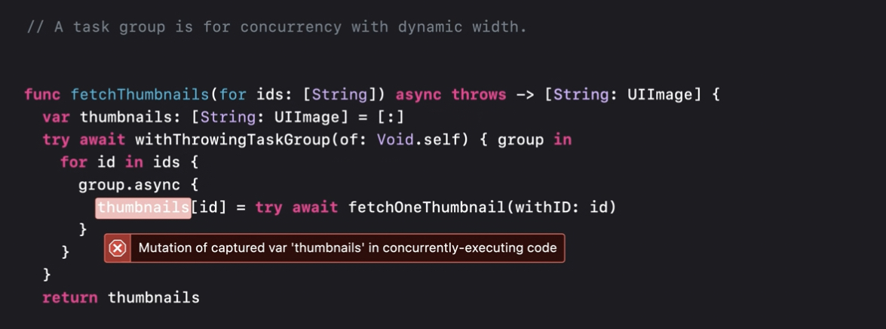
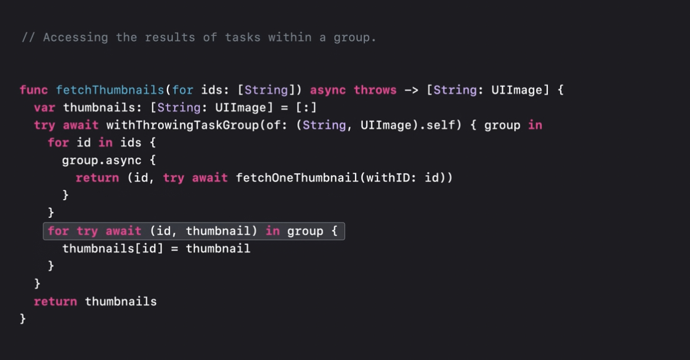
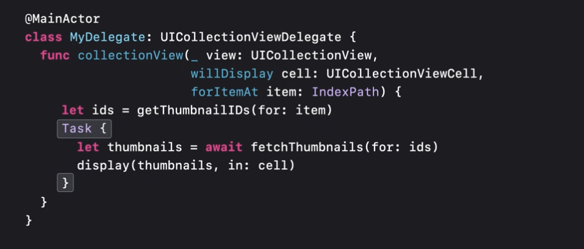

# concurrency란?

## [synchronous vs asynchronous (in Swift)](https://developer.apple.com/wwdc21/10132)
- synchronous function을 호출하면, 함수가 종료될 때까지 thread가 block된다.
- asynchronous function을 호출하면, 함수가 동작하는 중에 thread에게 다른 일을 시키고(suspension) 함수가 종료되면 해당 스레드에 알려준다.
	- by completion handler,
	-  delegate callbacks
	- or returning value (with async keyword)
- asynchronous function은 실제 함수가 완료(complete)되기 전에 바로 `return`한다.
- parallel은 실제로 동시에(at the same time) 여러 코드를 동작시킴을 의미한다.
- [주로 swift에서 concurrency는 parallel과 concurrent를 함께 지칭한다.](https://docs.swift.org/swift-book/LanguageGuide/Concurrency.html)


# [Grand Central Dispatch(GCD)](https://en.m.wikipedia.org/wiki/Grand_Central_Dispatch)
- medium [How to use Apple’s Grand Central Dispatch library to multitask threads like a Pro](https://medium.nextlevelswift.com/how-grand-central-dispatch-uses-queues-to-manage-concurrent-task-threads-33aa866f30ba?gi=d2151d702c80)
- Introduced in iOS4 (2010)
- Objective-c부터 사용하던 동시성 프로그래밍 API
- implementation of task parallelism based on the thread poll pattern
- Thread poll을 developer가 관리하는 대신 OS가 직접 관리해주는 것
- **GCD works by allowing specific tasks in a program that can be run in parallel to be queued up for execution and, depending on avaliability of processing resources, scheduling then to execute on any of available processor cores**

## **Dispatch Queues**

> **Dispatch Queues** are objects that maintain a queue of tasks, either anonymous code blocks or function, and execute these tasks in their turn 

- https://www.raywenderlich.com/5370-grand-central-dispatch-tutorial-for-swift-4-part-1-2
- Library는 기본적으로 여러개의 queue들을 생성한다.
	- **Main queue**: runs on the main thread and is a serial queue
	- **Global queues**: 전체 시스템이 공유하는 concurrent queue. 각기 다른 priority를 갖는 네 개의 큐가 있다. 
- client도 직접 queue를 생성할 수 있다. (**Custom queues**)
	- serial or concurrent
	- 해당 Request들은 실제로는 global queue들 중 하나에서 작동된다.
- FIFO queue
- Serial 또는 Concurrent Type이다.
	- concurrent queue에서도 task를 순서대로 실행을 시작한다.
	- 단, suspend 될 수 있기 때문에 언제 다음 task가 시작될 지, 몇 개의 task가 동시에 작동하고 있는 지는 알 수 없다.
	- GCD는 task들을 다른 core에서 실행시키거나, context switch를 통해 다른 task를 실행할 수도 있다. 
- 코드 블럭 형식으로 태스크를 전달받는다.
- 전달된 태스크들은 시스템에 의해 관리되는 thread poll에서 작동한다.
- **Avoiding Excessive Thread Creation**
	- 현재 할당된 태스크로 thread가 블락되면, 시스템은 새로운 스레드를 생성하여 다른 테스크들을 동작시킨다.
	- 너무 많은 private concurrent dispatch queue를 생성해도 너무 많은 스레드가 생성될 수 있다. 

# async/await in Swift
- [WWDC2021](https://developer.apple.com/wwdc21/10132)에서 처음 소개됨

## Problems with GCD
- CPU가 블락될 떄마다 새로운 스레드를 생성하므로 thread explosion이 발생할 수 있다.
	- thread는 각자 리소스를 가지고 있으므로 memory overhead
	- + excessive context switch
- completion handler로 코드의 직관성이 떨어지고, human-error의 위험성이 높아진다.

```swift

func fetchThumbnail(for id: String, completion: @escaping (UIImage?, Error?) -> Void) {
    let request = thumbnailURLRequest(for: id)
    let task = URLSession.shared.dataTask(with: request) { data, response, error in
        if let error = error {
            completion(nil, error)
        } else if (response as? HTTPURLResponse)?.statusCode != 200 {
            completion(nil, FetchError.badID)
        } else {
            guard let image = UIImage(data: data!) else {
		  // completion을 호출하지 않아서 caller는 에러 발생 유무를 전달 받지못한다.
                return
            }
            image.prepareThumbnail(of: CGSize(width: 40, height: 40)) { thumbnail in
                guard let thumbnail = thumbnail else {
                    completion(nil, FetchError.badImage)
                    return
                }
                completion(thumbnail, nil)
            }
        }
    }
    task.resume()
}
```
## Async, Await

- the keyword `await` indicates that async function might suspend there
- async function
	- will finish and return control to your function
	- but it can give up control of the thread in an entirely different way: by suspending
	- (normal function에서는 함수를 종료하는 것 외에 제어권을 넘길 수 있는 방법이 없다)
	- async function은 호출되면 thread의 제어권을 부여받고, suspension을 통해 해당 제어권을 system에 넘긴다. (caller function에 넘기는 게 아니다!)
	- system은 thread에 다른 작업들을 할당하다가, suspension된 function을 다시 진행한다.
- `await` 키워드는 suspensionable point를 의미한다. 해당 point를 기점으로 thread가 바뀔 수도 있고, 해당 suspension에 다른 작업이 실행될 수 있다.
- await은 async 함수에서만 이용 가능하다. 
- `async` 키워드는 함수가 suspensionable함을 의미한다. 함수가 suspension되면 caller도 suspension된다. 즉, async function의 caller도 async function 이어야 한다.

## Implementation
- 같은 코드를 async, await을 이용해서 표현하면

```swift
func fetchThumbnail(for id: String) async throws -> UIImage {
    let request = thumbnailURLRequest(for: id)  
    let (data, response) = try await URLSession.shared.data(for: request)
    guard (response as? HTTPURLResponse)?.statusCode == 200 else { throw FetchError.badID }
    let maybeImage = UIImage(data: data)
   // property가 async로 정의되어있다.
    guard let thumbnail = await maybeImage?.thumbnail else { throw FetchError.badImage }
    return thumbnail
}
```
- 간단해지고,직관적이어진다. 
- 기존 swift의 error handling 방식을 그대로 이용할 수도 있다.
- task의 dependencies들을 트래킹할 수 있다.
- 컴파일 단계에서 동기화 관련 에러를 발생시킨다.

## 작동방식
- thread는 6개(for iPhone, cpu 개수만큼)밖에 없고, lightweight thrad인 continuation(function call)을 스위치한다. 
- non-async function에서는 stack을 이용해서 호출될 때마다 해당 함수를 pop!
- async function에서는 stack과 heap을 이용,
	- suspension point(marked with `await`) 간 전달 될 필요가 없는 local variable을 stack에 저장하고
	- suspension point간 전달될 variable을 heap에 저장된다
	- await 함수를 호출하거나 continuation switch를 통해 컨텍스트가 변경되면 stack에 push하는 대신, replace한다.

## considerations when using swift concurrency
1. Performance
	- concurrency는 추가적인 메모리와 로직을 필요로 한다.
2. `await` 구간에서 thread가 변경될 수 있음을 기억해야 한다.
	- atomicity가 깨지고,
	- thread specific data가 변경될 수 있다.
3. swift의 runtime contract인 Forward progress(hreads can always make forward progress)를 지켜줘야 한다. 
	- 오른쪽으로 갈수록 스레드를 블럭할 수 있는 위험성이 높아진다.


# [우선순위 역전(Priority Inversion)](https://engineering.linecorp.com/ko/blog/about-swift-concurrency/)
- 우선순위가 높은 태스크가 더 낮은 우선순위의 태스크 때문에 실행되지 못하는 것
- 두 task간 리소스를 공유할 때 발생한다. 우선순위가 높은 태스크는 우선순위가 낮은 태스크가 종료되어 해당 리소스를 이용할 수 있게 될 때까지 기다려야 한다.
- GCD는 low priority queue의 QoS를 통째로 높여서 이를 해결한다. FIFO 큐를 이용하기 때문
	- 그렇게 되면, 자원을 공유하는 low priority task 앞에 있는 작업들이 모두 실행된 후, 
	- low priority task가 실행되고
	- high priority task가 실행된다. 
- Swift Concurrency(async, await)는 FIFO queue 대신 시스템이 직접 작업을 할당하기 때문에 우선순위가 높은 태스크가 바로 먼저 실행될 수 있다.
# structured concurrency in Swift
## Tasks
- a unit of work that can be run asynchronously as part of your program
- A unit of asynchronous work.
- 자동으로 parallel 동작을 지원함
- 생성되자마자 작업을 시작하기 때문에 직접 시작하거나, 스케쥴해줄 필요는 없다.
- Swift compiler가 자동으로 concurrency bug들을 잡아줌

## Async-let tasks
### Sequential binding
- one flow of execution 

### concurrent binding


- parent task는 child tasks들이 모두 완료된 상태에서만 종료 가능하다. 
- 만약 child task 중 하나가 비정상적으로 종료된다면, parent task도 error를 던진다. 남은 unawaited task들에 대해서는 cancel을 마크해놓는다.
- cancel 마크는 task와 그 subtask들에게 response가 필요없음을 알린다. 
- Cancellation is cooperative
	- tasks are not stopped immediately when cancelled
	- code must check for cancellation explictly and wind down execution
	- API를 구현할 때 항상 cancellation을 고려하여야한다.

- cancellation을 고려한 코드
	- cancel이 일어난 경우 result의 일부를 리턴하도록 설계하였다
	- `fetchOneThumbnail` 함수가 모두 완료된 이후에 다음 loop가 시작된다.
## Group tasks
- more flexibility (than async-let)
- **A task group is a form of structured concurrency that is designed to provide a dynamic amout of concurrency** by calling the withThrowingTaskGroup function
- group에 추가되자마자 task는 시작된다. 


- dictionary에 한 번에 하나만 접근할 수 있기 때문에 Data-race 가 발생한다.
- swift compiler가 잡아줌 ㄱㅇㄷ
### Data-race safety
- Task를 생성때 이용하는 closure는 `@Sendable` closure 타입이다.
- Sendable closure에서는 mutliple varialble을 이용할 수 없다. 
- 대신 value type, actors, or class that implement their own synchronization을 이용해야한다. 

- child tasks inherit priority from parent

## Unstructured Tasks
### when to use
- when tasks need to launch for non-async contexts
- when tasks live beyond the confines of a single scope


## Detached Tasks
- unscoped lifetime
- do not inherit anything form their originating context
- optional parameters control priority


# Use async/await with URLSession
## URLSession.data

```swift
let (data, response) = try await URLSession.shared.data(from: url)
guard let httpResponse = response as? HTTPURLResponse,
      httpResponse.statusCode == 200 /* OK */ else {
    throw MyNetworkingError.invalidServerResponse
}
```

## URLSession.download

```swift
let (location, response) = try await URLSession.shared.download(from: url)
guard let httpResponse = response as? HTTPURLResponse,
      httpResponse.statusCode == 200 /* OK */ else {
    throw MyNetworkingError.invalidServerResponse
}

try FileManager.default.moveItem(at: location, to: newLocation)
```

- file을 자동으로 지우지 않음

## URLSession.upload

```swift
var request = URLRequest(url: url)
request.httpMethod = "POST"

let (data, response) = try await URLSession.shared.upload(for: request, fromFile: fileURL)
guard let httpResponse = response as? HTTPURLResponse,
      httpResponse.statusCode == 201 /* Created */ else {
    throw MyNetworkingError.invalidServerResponse
}
```

## URLSessionTask-specific delegate
- session, task delegate가 둘 다 있으면 task delegate가 작동한다.

# [Actors](https://docs.swift.org/swift-book/LanguageGuide/Concurrency.html)
- Reference type
- actors allow only one task to access their mutable state at a time
- which makes it safe for code in multiple tasks to interact with the same instance for an actor

```swift
actor TemperatureLogger {
    let label: String
    var measurements: [Int]
    private(set) var max: Int

    init(label: String, measurement: Int) {
        self.label = label
        self.measurements = [measurement]
        self.max = measurement
    }
}
```

- keyword `actor` 를 이용하여 actor를 정의할 수 있다.
- 인스턴스를 만들 때에는 structure나 class를 이용할 때와 동일한 방법을 사용한다.
- 다른 점은, actor의 property나 method에 접근할 때에는 `await` 을 추가해야한다. 이를 통해 해당 지점이 suspension point일 수 있음을 드러낸다.
- actor는 항상 한 번에 하나의 task만 접근을 허용하기 때문에, 다른 task가 이미 actor instance를 이용하고 있다면, 해당 동작은 suspension된다.
- actor 내부에서 자기 자신의 property에 접근할 때에는 `await`을 이용하지 않아도 된다.
```swift
let logger = TemperatureLogger(label: "Outdoors", measurement: 25)
print(await logger.max)
// Prints "25"
```


> **Additional References**
- WWDC21 [Meet async/await in Swift](https://developer.apple.com/wwdc21/10132)
-  Dev_pingu [Meet async/await in Swift 한글 정리본](https://icksw.tistory.com/266?category=969205)
- LIne engineering [Swift Concurrency에 대해서](https://engineering.linecorp.com/ko/blog/about-swift-concurrency/)
- Koyeb [Introudction to Synchronous and Asynchrnous Processing](https://www.koyeb.com/blog/introduction-to-synchronous-and-asynchronous-processing)
